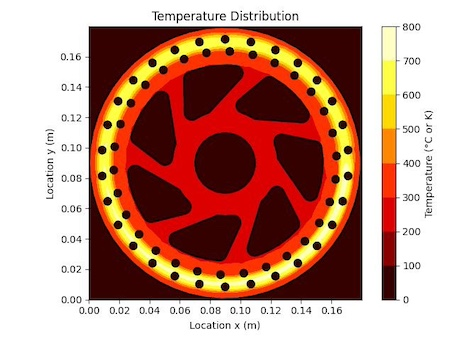
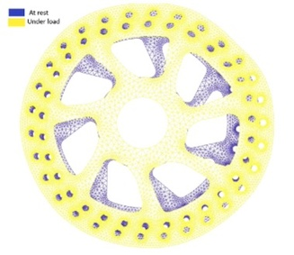



This project simulates the transient thermal behavior of a bicycle disc brake during a braking event. Leveraging **CUDA** for high-performance parallel computing, the simulation models the heat generation from a rotating brake pad and the cooling effects of forced convection.

After computing the heat transfer, parallelize the Conjugate Gradient (CG) method to solve the displacement:  
$$ [Kr]\cdot[x]=[Fr]​ $$
Here, \\(Kr\\)​ is a 27,880 × 27,880 stiffness matrix, \\( Fr \\)​ is a 27,880 × 1 force vector, and \\( x \\) is the displacement vector (for 13,940 nodes in both x and y directions).

---

## Simulation Goals & Geometry

* **Geometry Source**: Brake \\( (1070 \times 1070) \\) grid.
* **Solid (Disk)**: Pixel value \\( \le 200 \\).
* **Air**: Pixel value \\( > 200 \\) (excluded from thermal simulation).
* **Physical Specifications**:
    * **Diameter**: 180 mm \\( (dx = dy \approx 0.168 \text{ mm}) \\).
    * **Thickness**: 2 mm.
    * **Material**: Steel \\( (\rho = 8050 \text{ kg/m}^3, k = 16.25 \text{ W/m.K}, C_p = 502 \text{ J/kg.K}) \\).
* **Initial Condition**: Uniform temperature of 300 K.

---

## Thermal Physics Model

### 1. Dynamic Heat Source
Instead of a rotating disk, the simulation moves the brake pad relative to a static disk:
* **Pad Radius**: 5 mm.
* **Location**: 80 mm from the disk center.
* **Rotation**: 100 RPM.
* **Heat Flux**: A total of \\(12,000 \text{ W}\\) is applied.
* **Stability**: Due to the high flux, a small time step (\\(\Delta t = 0.00002 \text{ s}\\)) is used to ensure numerical stability.

### 2. Forced Convection Cooling
Each cell in the disk is cooled based on its local velocity \\(V(x, y)\\):
* **Reynolds Number (\\(Re_R\\))**:
    $$Re_R = \frac{2\rho\pi R V}{\mu}$$
    *(Parameters: \\(\rho_{air} = 1.25 \text{ kg/m}^3\), \(\mu = 1.81 \times 10^{-5} \text{ Pa.s}\\))*
* **Convection Coefficient (\\(h\\))**: Calculated using the Nusselt number correlation for a rotating disk: 
    $$h = \frac{0.664 \cdot \sqrt{Re_R} \cdot k_{air}}{2\pi R}$$
    *(Parameters: \\(k_{air} = 0.026 \text{ W/m.K}\\))*
* **Heat Loss (\\(\Delta Q\\))**: Based on Newton's Law of Cooling: 
    $$\Delta Q = \Delta t \cdot \Delta x \cdot \Delta y \cdot h \cdot (T(x,y) - 300)$$

---

## Technical Implementation

### CUDA Acceleration
* **Finite Difference Method (FDM)**: Solves the 2D unsteady heat conduction equation.
* **Kernel Mapping**: Each thread computes the temperature update for a single grid cell, accounting for conduction, heat source injection, and convective loss.

```c
void call_GPU_function(float *d_Body, float *d_T, float *d_Tnew, 
int NX, int NY, float L, float H, float DT, int step) {
    int N = NX * NY;
    int threadsPerBlock = 128;
    // int threadsPerBlock = 256;
    int blocksPerGrid = (N + threadsPerBlock - 1) / threadsPerBlock;
    compute_temperature<<<blocksPerGrid, threadsPerBlock>>>(d_Body, d_T, d_Tnew, NX, NY, L, H, DT, step);
}
```

* **Memory Management**: Efficient data transfer between Host (CPU) and Device (GPU) and high-speed `Device_to_Device` copies for time-stepping.

```c
void Device_to_Device(float **d_b, float **d_a, int N){
    size_t size = N*sizeof(float);
    cudaError_t Error;
    Error = cudaMemcpy(*d_b, *d_a, size, cudaMemcpyDeviceToDevice);
    // printf("CUDA error (memcpy d_a -> d_b) = %s\n", cudaGetErrorString(Error));
}
```

* **Compressed Sparse Row**: Since the stiffness matrix \\( Kr \\) is highly sparse (most elements are zero), utilized the Compressed Sparse Row (CSR) format to represent the \\(27,880 \times 27,880\\) system.

* **Conjugate Gradient (CG) method**: The overall algorithm devided into four milstones: 
  1. Storage of the matrix Kr 
  2. Vector x Constant computation 
  3. Matrix x vector computation 
  4. Dot Product  

The CUDA-based Conjugate Gradient (CG) implementation achieves an approximate **8× speedup** compared to MATLAB’s direct matrix division approach.

See [Pseudocode on Wiki](https://en.wikipedia.org/wiki/Conjugate_gradient_method) and final implementation on [Github](https://github.com/Chih-Yu/NCKU-Parallel-GPU-2025/blob/main/Tutorial_11/tutorial_11.cu).

---

## Experience Results




---